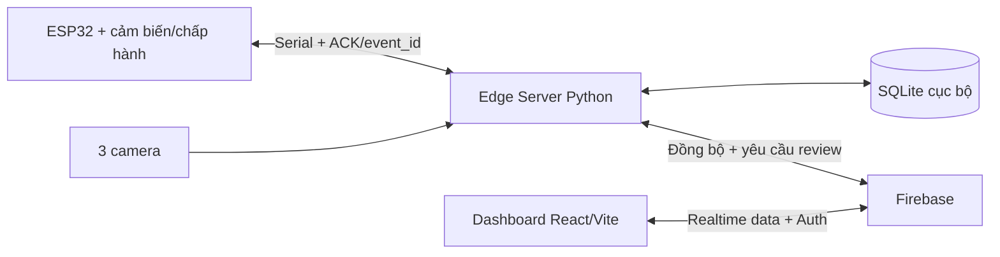

# Cấu trúc dự án PBL4 - Bãi đỗ xe thông minh

> Phiên bản cập nhật: tích hợp InsightFace cho xác thực khuôn mặt 1:1 trên Edge Server.

## 1. Kiến trúc được chọn

Dự án nên được tổ chức theo kiểu **monorepo**: toàn bộ Edge Server, firmware ESP32, Web Dashboard, cấu hình Firebase, tài liệu và kiểm thử nằm trong một repository. Cách này phù hợp với đồ án nhóm vì các giao thức dùng chung có thể được quản lý tại một nơi, nhưng mỗi thành phần vẫn chạy và triển khai độc lập.



Nguyên tắc bắt buộc:

- Edge Server là nơi duy nhất đưa ra quyết định mở barie.
- ESP32 chỉ đọc cảm biến, thi hành lệnh và trả về ACK/trạng thái.
- Dashboard không gửi lệnh trực tiếp đến ESP32; nó chỉ tạo yêu cầu xác nhận thủ công để Edge Server kiểm tra lại.
- SQLite là nguồn dữ liệu vận hành cục bộ. Firebase là bản dữ liệu giám sát được đồng bộ.
- Face embedding chỉ tồn tại trong SQLite cục bộ, không gửi lên Firebase và không gửi xuống ESP32.
- Ảnh khuôn mặt chỉ tồn tại trong bộ nhớ trong lúc xử lý; không tạo thư mục lưu ảnh khuôn mặt lâu dài.

## 2. Cây thư mục đầy đủ đề xuất

```text
smart-parking-pbl4/
├── README.md
├── .gitignore
├── .editorconfig
├── .env.example
├── LICENSE
├── THIRD_PARTY_NOTICES.md              # Giấy phép thư viện và model bên thứ ba
│
├── docs/                              # Tài liệu thiết kế và báo cáo
│   ├── requirements/
│   │   ├── functional-requirements.md # FR01-FR10
│   │   ├── non-functional.md          # Hiệu năng, bảo mật, riêng tư
│   │   └── traceability-matrix.md     # FR -> module -> test case
│   ├── architecture/
│   │   ├── system-context.md
│   │   ├── component-design.md
│   │   ├── deployment-design.md
│   │   └── decisions/                 # Architecture Decision Records
│   │       ├── ADR-001-edge-authority.md
│   │       ├── ADR-002-local-face-data.md
│   │       ├── ADR-003-firebase-sync.md
│   │       └── ADR-004-insightface-inference.md
│   ├── diagrams/
│   │   ├── architecture.mmd
│   │   ├── sequence-entry.mmd
│   │   ├── sequence-parking.mmd
│   │   ├── sequence-exit.mmd
│   │   ├── sequence-manual-review.mmd
│   │   ├── state-gate.mmd
│   │   ├── state-session.mmd
│   │   ├── state-parking.mmd
│   │   └── database-erd.mmd
│   ├── protocols/
│   │   ├── serial-protocol.md
│   │   ├── firebase-contract.md
│   │   └── error-codes.md
│   ├── database/
│   │   ├── sqlite-schema.md
│   │   ├── firebase-schema.md
│   │   └── data-retention.md
│   ├── testing/
│   │   ├── test-plan.md
│   │   ├── acceptance-scenarios.md
│   │   └── evaluation-metrics.md
│   └── setup/
│       ├── hardware-wiring.md
│       ├── camera-placement.md
│       ├── insightface-setup.md
│       ├── local-development.md
│       └── demo-runbook.md
│
├── contracts/                         # Hợp đồng dùng chung giữa 3 codebase
│   ├── serial/
│   │   ├── commands.schema.json
│   │   ├── events.schema.json
│   │   └── examples.json
│   ├── firebase/
│   │   ├── parking-slot.schema.json
│   │   ├── parking-session.schema.json
│   │   ├── event.schema.json
│   │   └── review-request.schema.json
│   ├── states.json                    # Trạng thái phiên, cổng và ô đỗ
│   └── error-codes.json               # Một danh sách mã lỗi chuẩn
│
├── edge-server/                       # Python 3.10+, trung tâm của hệ thống
│   ├── pyproject.toml                 # insightface, onnxruntime, OpenCV, NumPy...
│   ├── README.md
│   ├── .env.example
│   ├── src/
│   │   └── smart_parking/
│   │       ├── __init__.py
│   │       ├── main.py                # Điểm chạy chương trình
│   │       ├── bootstrap.py           # Ghép config, adapter và service
│   │       │
│   │       ├── config/
│   │       │   ├── settings.py        # Đọc env/YAML, không chứa secret cứng
│   │       │   ├── constants.py
│   │       │   └── logging_config.py
│   │       │
│   │       ├── domain/                # Luật nghiệp vụ, không phụ thuộc thư viện ngoài
│   │       │   ├── enums.py           # SessionStatus, SlotStatus, ReasonCode...
│   │       │   ├── entities/
│   │       │   │   ├── parking_session.py
│   │       │   │   ├── parking_slot.py
│   │       │   │   ├── gate_transaction.py
│   │       │   │   ├── system_event.py
│   │       │   │   └── manual_review.py
│   │       │   ├── value_objects/
│   │       │   │   ├── plate_number.py
│   │       │   │   ├── face_template.py
│   │       │   │   └── decision_result.py
│   │       │   ├── state_machines/
│   │       │   │   ├── gate_state_machine.py
│   │       │   │   ├── session_state_machine.py
│   │       │   │   └── parking_state_machine.py
│   │       │   └── exceptions.py
│   │       │
│   │       ├── application/           # Điều phối use case
│   │       │   ├── ports/             # Interface để thay camera/DB/Serial bằng fake
│   │       │   │   ├── camera_port.py
│   │       │   │   ├── ai_port.py
│   │       │   │   ├── repository_port.py
│   │       │   │   ├── serial_port.py
│   │       │   │   └── cloud_port.py
│   │       │   ├── workflows/
│   │       │   │   ├── vehicle_entry.py
│   │       │   │   ├── vehicle_exit.py
│   │       │   │   ├── parking_monitor.py
│   │       │   │   ├── manual_review.py
│   │       │   │   └── data_retention.py
│   │       │   ├── services/
│   │       │   │   ├── access_decision_service.py
│   │       │   │   ├── slot_assignment_service.py
│   │       │   │   ├── session_service.py
│   │       │   │   ├── event_service.py
│   │       │   │   └── health_service.py
│   │       │   └── dto/
│   │       │       ├── gate_event_dto.py
│   │       │       ├── recognition_result_dto.py
│   │       │       └── review_request_dto.py
│   │       │
│   │       ├── ai/                    # Các pipeline CV/AI độc lập
│   │       │   ├── face/
│   │       │   │   ├── pipeline.py    # Chuỗi xử lý khuôn mặt hoàn chỉnh
│   │       │   │   ├── insightface_adapter.py # Bọc FaceAnalysis/SCRFD/ArcFace
│   │       │   │   ├── quality.py     # Mờ, sáng, kích thước, góc mặt
│   │       │   │   ├── liveness_policy.py # Chuẩn hóa kết quả RGB liveness
│   │       │   │   ├── template.py    # Mean + L2 normalize
│   │       │   │   ├── verifier.py    # Cosine + T_reject/T_accept
│   │       │   │   └── model_registry.py
│   │       │   ├── plate/
│   │       │   │   ├── pipeline.py
│   │       │   │   ├── detector.py
│   │       │   │   ├── orientation.py # Xử lý biển số xoay 180 độ
│   │       │   │   ├── ocr.py
│   │       │   │   ├── normalizer.py
│   │       │   │   └── validator.py
│   │       │   └── parking/
│   │       │       ├── pipeline.py
│   │       │       ├── occupancy.py   # Free/Occupied/Fault theo ROI
│   │       │       ├── temporal_filter.py
│   │       │       ├── slot_matcher.py
│   │       │       └── line_crossing.py
│   │       │
│   │       ├── infrastructure/        # Adapter cho thiết bị/dịch vụ thật
│   │       │   ├── camera/
│   │       │   │   ├── opencv_camera.py
│   │       │   │   ├── camera_manager.py
│   │       │   │   └── frame_buffer.py
│   │       │   ├── database/
│   │       │   │   ├── sqlite.py
│   │       │   │   ├── unit_of_work.py
│   │       │   │   ├── session_repository.py
│   │       │   │   ├── slot_repository.py
│   │       │   │   ├── event_repository.py
│   │       │   │   ├── review_repository.py
│   │       │   │   └── outbox_repository.py
│   │       │   ├── serial/
│   │       │   │   ├── esp32_client.py
│   │       │   │   ├── protocol.py
│   │       │   │   ├── message_parser.py
│   │       │   │   └── reconnect_policy.py
│   │       │   ├── firebase/
│   │       │   │   ├── firebase_client.py
│   │       │   │   ├── data_mapper.py
│   │       │   │   ├── sync_worker.py
│   │       │   │   ├── review_listener.py
│   │       │   │   └── plate_image_store.py # Chỉ dùng nếu thêm Firebase Storage
│   │       │   └── security/
│   │       │       ├── embedding_cipher.py
│   │       │       └── credential_loader.py
│   │       │
│   │       ├── interfaces/
│   │       │   ├── http/              # FastAPI cục bộ: health/review, không mở cổng trực tiếp
│   │       │   │   ├── app.py
│   │       │   │   ├── dependencies.py
│   │       │   │   └── routes/
│   │       │   │       ├── health.py
│   │       │   │       └── reviews.py
│   │       │   └── cli/
│   │       │       └── diagnostics.py
│   │       │
│   │       ├── workers/
│   │       │   ├── gate_event_worker.py
│   │       │   ├── parking_camera_worker.py
│   │       │   ├── cloud_sync_worker.py
│   │       │   ├── review_request_worker.py
│   │       │   ├── retention_worker.py
│   │       │   └── supervisor.py
│   │       └── observability/
│   │           ├── logger.py
│   │           ├── metrics.py         # P50/P95 và tỷ lệ lỗi
│   │           └── audit_log.py
│   │
│   ├── configs/
│   │   ├── app.example.yaml
│   │   ├── cameras.example.yaml
│   │   ├── models.example.yaml        # Model pack, provider và model root
│   │   ├── parking_slots.example.yaml # ROI/ranh giới A1-A2-B1-B2
│   │   ├── thresholds.example.yaml
│   │   ├── serial.example.yaml
│   │   └── retention.example.yaml
│   ├── migrations/                    # Phiên bản schema SQLite
│   │   ├── 001_initial.sql
│   │   ├── 002_face_templates.sql
│   │   └── 003_outbox.sql
│   ├── models/                        # File model tải cục bộ, không commit file lớn
│   │   ├── insightface/
│   │   │   ├── models/
│   │   │   │   └── buffalo_l/
│   │   │   │       └── .gitkeep      # Các file ONNX được tải vào đây
│   │   │   ├── addons/
│   │   │   │   └── .gitkeep          # liveness.onnx nếu sử dụng addon
│   │   │   └── README.md
│   │   └── plate/
│   │       └── README.md
│   ├── scripts/
│   │   ├── download_insightface_models.py
│   │   ├── verify_model_hashes.py
│   │   ├── init_database.py
│   │   ├── calibrate_face_thresholds.py
│   │   ├── calibrate_parking_rois.py
│   │   ├── benchmark_latency.py
│   │   ├── camera_diagnostics.py
│   │   └── purge_expired_embeddings.py
│   ├── tests/
│   │   ├── unit/
│   │   ├── integration/
│   │   ├── end_to_end/
│   │   ├── fixtures/
│   │   └── fakes/                     # FakeCamera/FakeESP32/FakeFirebase
│   └── var/                           # Dữ liệu runtime, toàn bộ được gitignore
│       ├── db/.gitkeep
│       ├── logs/.gitkeep
│       ├── plate_snapshots/.gitkeep
│       └── cache/.gitkeep
│
├── firmware/
│   └── esp32_smart_parking/           # Thư mục sketch mở bằng Arduino IDE
│       ├── esp32_smart_parking.ino
│       ├── config.example.h
│       ├── pins.h
│       ├── protocol.h
│       ├── protocol.cpp
│       ├── gate_state_machine.h
│       ├── gate_state_machine.cpp
│       ├── sensor_manager.h
│       ├── sensor_manager.cpp
│       ├── actuator_controller.h
│       ├── actuator_controller.cpp
│       ├── display_controller.h
│       ├── display_controller.cpp
│       ├── serial_transport.h
│       ├── serial_transport.cpp
│       └── README.md
│
├── firmware-tests/                    # Sketch kiểm tra từng phần cứng độc lập
│   ├── sensor_test/
│   ├── servo_test/
│   ├── lcd_test/
│   ├── buzzer_test/
│   └── serial_protocol_test/
│
├── dashboard/                         # React + TypeScript + Vite
│   ├── package.json
│   ├── vite.config.ts
│   ├── tsconfig.json
│   ├── index.html
│   ├── .env.example
│   ├── public/
│   └── src/
│       ├── main.tsx
│       ├── app/
│       │   ├── App.tsx
│       │   ├── router.tsx
│       │   └── providers.tsx
│       ├── features/
│       │   ├── auth/
│       │   ├── overview/
│       │   ├── parking-slots/
│       │   ├── active-sessions/
│       │   ├── history/
│       │   ├── alerts/
│       │   ├── manual-review/
│       │   └── device-health/
│       ├── shared/
│       │   ├── components/
│       │   ├── hooks/
│       │   ├── layouts/
│       │   ├── types/
│       │   ├── utils/
│       │   └── constants/
│       ├── services/
│       │   ├── firebase.ts
│       │   ├── auth.service.ts
│       │   ├── parking.service.ts
│       │   ├── session.service.ts
│       │   └── review.service.ts      # Tạo request, không gọi barie
│       └── test/
│           ├── setup.ts
│           ├── unit/
│           └── integration/
│
├── firebase/
│   ├── firebase.json
│   ├── .firebaserc.example
│   ├── database.rules.json
│   ├── database.indexes.json
│   ├── storage.rules                  # Chỉ cần nếu lưu ảnh biển số
│   ├── emulator-seed/
│   │   └── database.json
│   └── README.md
│
├── evaluation/                        # Đánh giá khoa học cho báo cáo PBL4
│   ├── README.md
│   ├── manifests/                     # Chỉ metadata; không commit dữ liệu mặt
│   ├── face/
│   │   ├── build_pairs.py
│   │   ├── calibrate_thresholds.py
│   │   ├── evaluate_tar_far.py
│   │   └── plot_roc.py
│   ├── plate/
│   │   └── evaluate_ocr.py
│   ├── parking/
│   │   └── evaluate_occupancy.py
│   ├── performance/
│   │   └── evaluate_latency.py
│   └── results/                       # CSV/biểu đồ kết quả, không chứa ảnh mặt
│
├── system-tests/                      # Kịch bản kiểm thử xuyên suốt hệ thống
│   ├── scenarios/
│   │   ├── entry_success.yaml
│   │   ├── exit_success.yaml
│   │   ├── face_mismatch.yaml
│   │   ├── parking_wrong_slot.yaml
│   │   ├── internet_offline.yaml
│   │   └── esp32_disconnected.yaml
│   └── hardware_in_loop/
│       └── README.md
│
└── scripts/
    ├── setup_edge.sh
    ├── setup_dashboard.sh
    ├── run_edge.sh
    ├── run_dashboard.sh
    ├── run_tests.sh
    └── check_contracts.py
```

## 3. Trách nhiệm của từng khối

| Khối | Có quyền làm gì | Không được làm gì |
|---|---|---|
| Edge Server | Xử lý AI, quản lý phiên, cấp ô, quyết định mở barie, lưu SQLite, đồng bộ cloud | Không lưu lâu dài ảnh khuôn mặt; không đẩy embedding lên cloud |
| ESP32 | Đọc hai cảm biến, lọc nhiễu, theo dõi trình tự, điều khiển servo/LCD/LED/buzzer, ACK | Không tự quyết định cho xe vào/ra; không truy cập Firebase |
| Firebase | Auth, dữ liệu giám sát realtime, yêu cầu review, lịch sử không nhạy cảm | Không trực tiếp điều khiển barie; không chứa embedding/ảnh mặt |
| Dashboard | Hiển thị, tra cứu, tạo yêu cầu xác nhận thủ công | Không ghi trạng thái nghiệp vụ tùy ý; không gửi lệnh Serial |

## 4. Ánh xạ yêu cầu FR vào module

| Yêu cầu | Module chính |
|---|---|
| FR01 Theo dõi ô đỗ | `ai/parking`, `parking_camera_worker.py`, `slot_repository.py` |
| FR02 Phát hiện xe tại cổng | `firmware/sensor_manager`, `gate_state_machine`, `serial` |
| FR03 OCR và khuôn mặt | `ai/plate`, `ai/face` |
| FR04 Quản lý xe vào | `workflows/vehicle_entry.py`, `slot_assignment_service.py` |
| FR05 Quản lý xe ra | `workflows/vehicle_exit.py`, `access_decision_service.py` |
| FR06 Điều khiển thiết bị | firmware `actuator_controller`, `display_controller` |
| FR07 Đồng bộ dữ liệu | SQLite `outbox_repository`, Firebase `sync_worker` |
| FR08 Dashboard | `dashboard/src/features/*` |
| FR09 Xử lý ngoại lệ | `ReasonCode`, state machine, worker supervisor, audit log |
| FR10 Xác nhận thủ công | `manual_review.py`, `review_listener.py`, `manual-review/` |

## 5. Vị trí và cách tích hợp InsightFace

InsightFace chỉ chạy trên laptop Edge Server. Không đưa InsightFace vào firmware ESP32, Dashboard hoặc Firebase. Repository `deepinsight/insightface` là mã nguồn của thư viện cùng nhiều thành phần nghiên cứu; dự án không cần chép hoặc clone toàn bộ repository này vào cây source.

Nguồn chính thức: <https://github.com/deepinsight/insightface>. Mã nguồn thư viện được phát hành theo MIT, nhưng pretrained model đi kèm được công bố cho nghiên cứu phi thương mại. Phạm vi PBL4 học thuật phù hợp; nếu phát triển thành sản phẩm thương mại thì phải kiểm tra và xin quyền sử dụng model phù hợp.

Tách InsightFace thành ba lớp:

| Thành phần | Vị trí | Vai trò |
|---|---|---|
| Python dependency | `edge-server/pyproject.toml` | Cài thư viện `insightface` và runtime ONNX |
| Code tích hợp của nhóm | `src/smart_parking/ai/face/insightface_adapter.py` | Khởi tạo `FaceAnalysis`, gọi inference và đổi kết quả sang DTO nội bộ |
| Model runtime | `edge-server/models/insightface/` | Chứa model pack ONNX và addon liveness đã tải sẵn |

Dependency cơ bản:

```toml
dependencies = [
    "insightface",
    "onnxruntime",
    "opencv-python",
    "numpy"
]
```

Khi môi trường chạy đã ổn định, phải khóa chính xác phiên bản trong lock file. Không để máy phát triển và máy demo tự lấy các phiên bản khác nhau.

InsightFace tìm model pack theo quy ước `<root>/models/<name>/`. Với cấu hình:

```yaml
face:
  model_root: models/insightface
  model_pack: buffalo_l
  providers:
    - CPUExecutionProvider
  detection_size: [640, 640]
  liveness_enabled: true
```

thì model được đặt tại:

```text
edge-server/models/insightface/
├── models/
│   └── buffalo_l/
│       └── *.onnx
└── addons/
    └── liveness.onnx
```

Adapter khởi tạo thư viện theo dạng:

```python
from insightface.app import FaceAnalysis

app = FaceAnalysis(
    name="buffalo_l",
    root="models/insightface",
    providers=["CPUExecutionProvider"],
    addons=["liveness"],
)
app.prepare(det_size=(640, 640))
```

`FaceAnalysis` chịu trách nhiệm chạy model SCRFD, căn chỉnh khuôn mặt và tạo embedding bằng model recognition trong pack. Code của đồ án vẫn phải tự chịu trách nhiệm cho các luật nghiệp vụ sau:

- Chỉ chấp nhận đúng một khuôn mặt trong vùng nhận diện.
- Kiểm tra ảnh mờ, tối, mặt quá nhỏ hoặc góc mặt không phù hợp.
- Chuẩn hóa kết quả liveness thành `LIVENESS_FAILED` hoặc `LIVENESS_INPUT_REJECTED`.
- Tổng hợp nhiều embedding hợp lệ thành face template rồi chuẩn hóa L2.
- So sánh cosine với `T_reject` và `T_accept` đã hiệu chỉnh.
- Lưu `model_id`, dimension và `config_version` cùng embedding.
- Chuyển lỗi model hoặc kết quả không chắc chắn sang `Review_required`.

Không commit file ONNX lớn vào Git. `.gitignore` cần có:

```gitignore
edge-server/models/insightface/**/*.onnx
edge-server/models/insightface/**/*.zip
```

Model phải được tải trước buổi demo bằng `download_insightface_models.py`, kiểm tra hash và chạy thử offline. Mã nguồn thư viện InsightFace có giấy phép riêng với pretrained model; thông tin nguồn, phiên bản và điều kiện sử dụng phải được ghi trong `THIRD_PARTY_NOTICES.md`.

## 6. Thiết kế SQLite tối thiểu

Không nên đặt face embedding chung với bảng lịch sử. Tách riêng giúp xóa dữ liệu sinh trắc học đúng thời hạn mà vẫn giữ được lịch sử sự kiện.

| Bảng | Mục đích |
|---|---|
| `parking_slots` | Trạng thái vật lý, thông tin giữ ô, thời điểm quan sát gần nhất |
| `parking_sessions` | Biển số, ô được gán, ô thực tế, trạng thái phiên/đỗ, thời gian vào-ra |
| `face_templates` | BLOB embedding, model_id, dimension, config_version, quality, thời hạn xóa |
| `gate_transactions` | event_id, hướng vào/ra, trạng thái tiến trình, timeout, tính idempotent |
| `system_events` | Nhật ký sự kiện và mã lý do |
| `parking_alerts` | Wrong_slot, Line_crossing, Parking_timeout và trạng thái xử lý |
| `manual_reviews` | Người duyệt, yêu cầu, quyết định, thời gian và dữ liệu audit |
| `device_status` | Camera, ESP32, cảm biến và kết nối Internet |
| `outbox` | Hàng đợi đồng bộ Firebase có retry; bảo đảm mất mạng không mất sự kiện |

Ràng buộc quan trọng:

- Không được tồn tại hai phiên `Entry_pending`/`Active` cho cùng một biển số.
- Việc tạo `Entry_pending` và giữ ô phải nằm trong cùng một transaction.
- `event_id` hoặc `gate_transaction_id` phải unique để sự kiện Serial gửi lại không làm cập nhật hai lần.
- Trạng thái vật lý của ô (`Free/Occupied/Fault`) tách khỏi trạng thái giữ logic (`Unassigned/Assigned`).
- Chỉ giải phóng ô khi phiên đã kết thúc và camera xác nhận `Free` ổn định.

## 7. Giao thức Serial cần thống nhất trước khi viết code

Mỗi message nên có tối thiểu:

```json
{
  "version": 1,
  "message_id": "uuid-or-sequence",
  "type": "GATE_IN_TRIGGER",
  "gate_transaction_id": "GT-...",
  "timestamp_ms": 0,
  "payload": {},
  "checksum": "..."
}
```

Nhóm lệnh Edge -> ESP32: `OPEN_GATE`, `SET_LCD`, `SET_GUIDANCE`, `BUZZER`, `PING`.

Nhóm sự kiện ESP32 -> Edge: `GATE_IN_TRIGGER`, `GATE_OUT_TRIGGER`, `PASSAGE_COMPLETED`, `SENSOR_STATE`, `COMMAND_ACK`, `DEVICE_ERROR`, `HEARTBEAT`.

`COMMAND_ACK` chỉ xác nhận đã nhận/thực hiện lệnh. Nó không được dùng thay cho `PASSAGE_COMPLETED`.

## 8. Hai điểm cần bổ sung vào bản thiết kế hiện tại

1. **Ảnh biển số trên Dashboard:** Realtime Database không phù hợp để chứa file ảnh. Nếu Dashboard bắt buộc hiển thị ảnh biển số từ xa, nên bổ sung Firebase Storage chỉ dành cho ảnh biển số, kèm `storage.rules`. Tuyệt đối không tải ảnh khuôn mặt lên đó. Nếu không muốn dùng Storage, FR08 nên đổi thành chỉ hiển thị chuỗi biển số.
2. **Kênh xác nhận thủ công:** nên chốt một hướng. Với kiến trúc hiện tại, phù hợp nhất là Dashboard ghi một `reviewRequest` có chữ ký tài khoản quản trị lên Firebase; Edge Server lắng nghe, kiểm tra quyền/trạng thái/điều kiện an toàn rồi mới quyết định. Dashboard không ghi trực tiếp `gateCommand`.

Ngoài ra, phần “Sơ đồ tuần tự” và “Thuật toán + Database” trong PDF hiện chưa có nội dung chi tiết. Các thư mục `docs/diagrams/`, `docs/database/` và `docs/testing/` ở trên được dành để hoàn thiện chính ba phần này.

## 9. Thứ tự dựng project nên thực hiện

1. Chốt `contracts/`: trạng thái, mã lỗi, JSON message Serial và Firebase schema.
2. Viết state machine + SQLite trước, chạy bằng FakeESP32/FakeCamera.
3. Viết firmware và kiểm tra riêng từng cảm biến/servo/LCD, sau đó tích hợp Serial.
4. Cài InsightFace, tải `buffalo_l`, chạy adapter trên CPU và xác nhận hoạt động offline.
5. Hoàn thiện lần lượt plate pipeline, face pipeline và parking pipeline; không ghép tất cả ngay từ đầu.
6. Thu thập tập validation để hiệu chỉnh `T_reject`, `T_accept` và các ngưỡng chất lượng.
7. Ghép luồng xe vào, xác nhận đã đi qua, đỗ xe, rồi mới làm luồng xe ra.
8. Thêm outbox và đồng bộ Firebase khi luồng local đã ổn định.
9. Làm Dashboard và manual review.
10. Chạy kiểm thử end-to-end, đo P50/P95, TAR/FAR, OCR accuracy và occupancy accuracy.

## 10. Phạm vi MVP nên ưu tiên

MVP đầu tiên chỉ cần chứng minh được một chu trình hoàn chỉnh:

- Một xe vào -> nhận diện biển số/khuôn mặt -> giữ và cấp ô -> xác nhận đi qua.
- Camera toàn cảnh xác nhận xe đỗ đúng/sai.
- Xe ra -> tìm phiên bằng biển số -> xác thực khuôn mặt 1:1 -> xác nhận đi qua -> đóng phiên.
- Mất Internet vẫn vận hành local và đồng bộ lại sau đó.
- Một trường hợp lỗi được chuyển `Review_required` và được quản trị viên xử lý có audit log.

Các chức năng như tối ưu nhiều xe đồng thời, huấn luyện lại model, nhận dạng biển số xe thật hoặc chống giả mạo nâng cao nên để ngoài MVP của PBL4.
